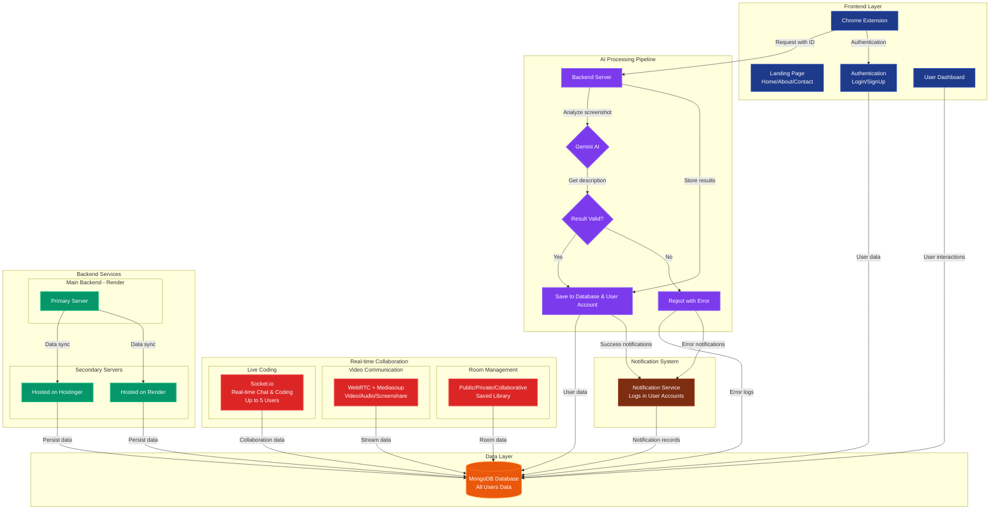

# 🌐 **DirectCode UI - Landing Page DirectCode UI**

### *Capture • Convert • Collaborate • Build UI faster than ever*

<p align="center">
  
</p>

<p align="center">
  <a href="https://www.directcodeui.in/"></a>
  <a href="https://github.com/Yash-Yadav-901/Direct-Code-Dev"></a>
  
  
  
  
  
</p>

https://chromewebstore.google.com/detail/fhgapmfjgjncfhjkbkpnpagflbcokihb?utm_source=item-share-cb

## 🌟 Overview

**DirectCode UI** is a full-stack developer ecosystem that allows you to:

✅ Capture UI from any website via Chrome Extension

✅ Convert it into **clean HTML/CSS/JS using AI (Gemini)**

✅ Edit, download, save, or publish components

✅ Collaborate **in real time** (code + chat + video + screen share)

✅ Build component libraries and share with the world

---

## 🎯 Key Features

| Feature                            | Description                                    |
| ---------------------------------- | ---------------------------------------------- |
| 🔍 **Smart UI Capture**            | Select any UI from any website via extension   |
| 🤖 **AI Code Generation**          | Converts UI → Clean HTML/CSS/JS using Gemini   |
| ⚡ **Live Code Preview & Edit**     | Instant realtime rendering & modification      |
| 👥 **Collaboration Rooms**         | Live multi-user code, chat, video, screenshare |
| 🧠 **Component Libraries**         | Save Private / Publish Public / Contribute     |
| 🔐 **Local API Key Storage**       | Your Gemini key stays in browser (safe)        |
| 🔔 **Request Tracking System**     | Process → Done → Error notifications           |
| 🚀 **Microservice Infrastructure** | Scalable backend with 6+ services              |

🎯 AI-Powered UI Extraction

  👉 Smart Capture: Use our Chrome extension to select any UI element with rectangle selection
  
  👉 Gemini AI Integration: Generate clean HTML, CSS, and JavaScript code automatically
  
  👉 Real-time Processing: Track request status with live notifications

🏗️ Code Management

  👉 Personal Libraries: Private and public libraries for your UI components
  
  👉 Public Library: Discover and use components from other developers
  
  👉 Code Editing: Built-in editor with HTML, CSS, and JS tabs
  
  👉 Export Options: Download code as ZIP files or copy directly

👥 Real-time Collaboration

  👉 Multi-user Rooms: Collaborate with up to 5 developers simultaneously
  
  👉 Live Code Editor: See collaborators' cursors with colored indicators
  
  👉 Video & Audio Chat: Integrated communication tools
  
  👉 Screen Sharing: Share your screen during collaboration sessions
  
  👉 Text Chat: Real-time messaging within rooms

📱 User Experience

  👉 User Accounts: Secure authentication and profile management
  
  👉 Notification System: Bell icon for tracking request status
  
  👉 Social Features: Like, save, follow, and view analytics
  
  👉 Admin Controls: Content moderation and post management
  
---

## 🧠 How It Works

1. Install Chrome extension & add Gemini API key
2. Visit any website → Select UI → Click **Capture**
3. AI generates reusable code
4. Component appears in your accounts library on directcodeui web app 
5. Edit it, download it, or collaborate with team

---
## System Architecture


---

## 🛠 Tech Stack

| Layer      | Tech                      |
| ---------- | ------------------------- |
| Frontend   | React, Vite, Tailwind CSS |
| Backend    | Node.js, Express          |
| Database   | MongoDB                   |
| AI         | Gemini API                |
| Real-Time  | WebRTC(mediasoup), Socket.io |
| Deployment | Vercel, Render/hostinger(vps)    |
| Extension  | Chrome Manifest v3        |


---
## 🧩 Microservices

| Service                        | Purpose                             |
| ------------------------------ | ----------------------------------- |
| `directcodeui-frontend`        | React dashboard                     |
| `directcodeui-backend`         | Main API (users, components, posts) |
| `directcodeui-extension`       | UI selector Chrome extension        |
| `directcodeui-genai-server`    | Gemini → Code generation            |
| `directcodeui-realtime-server` | Live collab (Socket.io)             |
| `directcodeui-video-server`    | WebRTC + Screen share               |
| `directcodeui-notify-server`   | Request status system               |

---

## 📸 UI Preview:

✅ Landing Page:

<video src="https://github.com/user-attachments/assets/4dc1ab8e-23e5-47dd-9cbe-f64be2883f15" 
       controls 
       width="700" autoplay>
</video>


✅ extention:

<video src="https://github.com/user-attachments/assets/9d1664b4-6f86-45a3-b8f1-b21c6752ab40" 
       controls 
       width="700" autoplay>
</video>

✅ Live realtime collabortion:

<video src="https://github.com/user-attachments/assets/c8ec23cf-cd5a-4d6f-aa1e-0c429032ea8a" 
       controls 
       width="700" autoplay>
</video>

✅ creating self element

<video src="https://github.com/user-attachments/assets/55adc108-4cac-4e53-9638-d2c53bae6eee" 
       controls 
       width="700" autoplay>
</video>


---


###  🚀 all the services

```bash
Landing Page: https://github.com/Yash-Yadav-901/Direct-Code-UI-Landing-
Main Frontend and Backend: https://github.com/Yash-Yadav-901/Direct-Code-Dev
Extention: https://github.com/Yash-Yadav-901/Direct-Code-Dev-UI-UX-Capturing-Extension-
GenAI: https://github.com/Yash-Yadav-901/Direct-Code-UI-GenAIandLogTracking-
realtime features: https://github.com/Yash-Yadav-901/Direct-Code-UI-Real-time-
real time: Videos:https://github.com/Yash-Yadav-901/Direct-Code-Ui-Real-time-V-server
```

### Install dependencies

```bash
npm install
```

### Start dev servers

```bash
npm run dev
```

---

## 🧩 Install Chrome Extension

1. Open `chrome://extensions/`
2. Enable **Developer Mode**
3. Click **Load unpacked**
4. Select `directcodeui-extension` folder ✅

---

## ⚡ Collaboration Capabilities

| Feature                      | Status |
| ---------------------------- | ------ |
| Live Code Editing            | ✅      |
| Cursor Presence              | ✅      |
| live Chatting                       | ✅      |
| live Video Call upto 5 members                  | ✅      |
| Screen Share                 | ✅      |
| Mic/Camera Control           | ✅      |
| Host Moderation (Kick/Block) | ✅      |

---
🎯 Usage Guide

✅ Getting Started

• Create an Account: Sign up on the DirectCodeUI web application

• Install Extension: Add the DirectCodeUI extension to Chrome

• Configure API Key: Set your Gemini AI API key in the extension (stored locally)

✅ Capturing UI Elements

•Browse to any website with UI elements you want to capture

• Click the DirectCodeUI extension icon

• Select rectangle selection mode and choose the UI element

• Click "Capture" to generate code

• Track progress via the bell icon in your dashboard

✅ Managing Components

• Private Library: Your personal collection of UI components

• Public Library: Share your components with the community

• Edit & Remix: Modify generated code directly in the editor

✅ Collaborative Development

• Create a Room from your dashboard

• Invite Team Members (up to 5 users)

• Start Coding with real-time collaboration

• Use Communication Tools - video, audio, and text chat

• Publish finished projects to public libraries

🔧 API Configuration

🤖 Gemini AI Setup

• Obtain Google Gemini API key from Google AI Studio

• Configure the key in Chrome extension settings

• API key is stored locally in your browser

📨 Environment Variables

• Each service requires specific environment variables. Refer to individual repository README files for detailed configuration.


---

## 📁 Folder Structure (Simplified)

```
directcodeui/
├─ frontend/        # Dashboard (React)
├─ backend/         # Main API
├─ extension/       # Chrome extension
├─ genai-server/    # UI→Code AI service
├─ realtime/        # Socket.io collab
├─ video-server/    # WebRTC / PeerJS
└─ notify-server/   # Status tracking
```


## 🤝 Community & Contribution

1. Fork the project
2. Create a feature branch
3. Commit & Push
4. Open a Pull Request ✅

---

## 📜 License

MIT © 2025 DirectCode UI

---

## 👨‍💻 Creator

**Yash Yadav**
3rd Year B.Tech CSE
Passionate about building developer tools Building developer tools⚡

---

## ⭐ If you like this project, give it a star!


---
